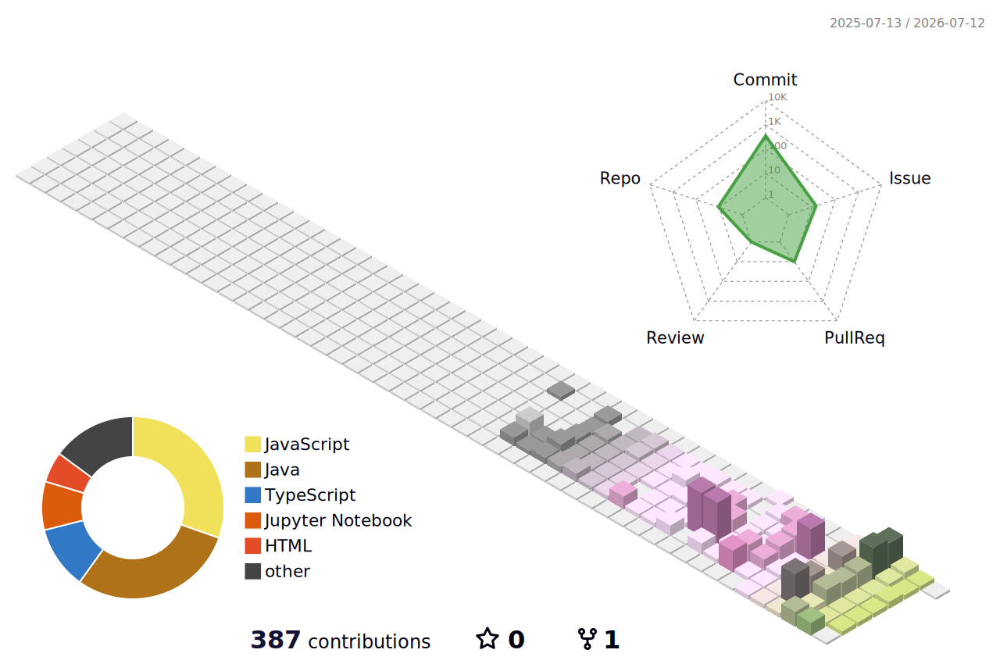

## ✨ Tech Stacks ✨

| Category | Tech Stack |
|---|---|
| **Frontend** |      |
| **Backend** |    |
| **Database** |   |
| **DevOps & OS** |   |
| **Collaboration & Design** |   |

## 🧑‍💻 Contact me 
 

  

    
